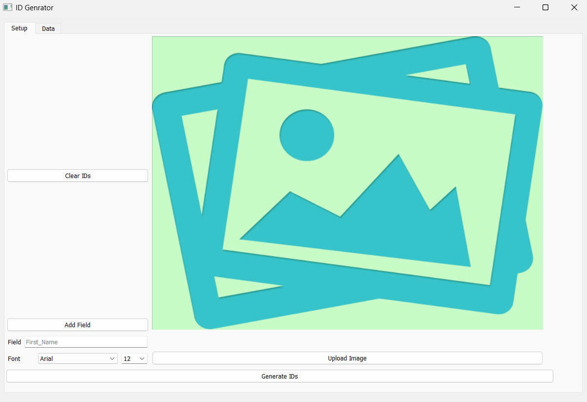
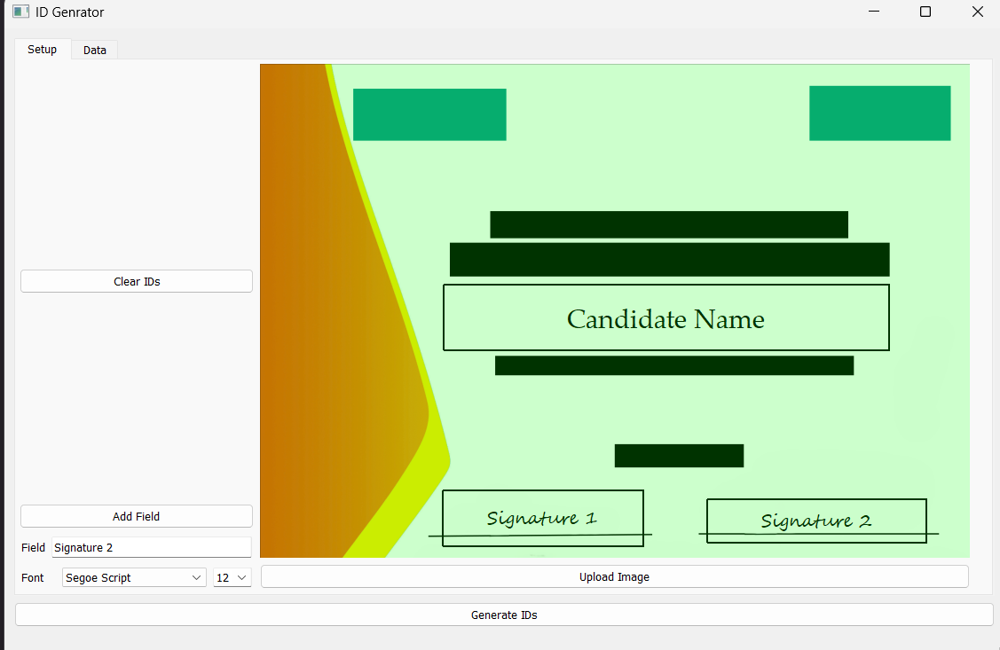
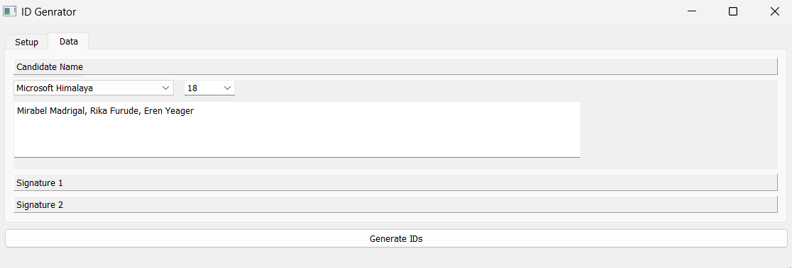

## Automatic Text Inserter
<hr>

### Description
<hr>

This app allows users to automatically generate a series of documents with custom text details for each document.
It uses an image template and overlays text in specific positions. This was initially created for automatically
inserting
students name for a certificate awarding ceremony, however it has several other applications such as inserting names and
IDs on ID cards, customizing invitation messages, customizing details on a poster, 
multi-language support for graphic design, etc. <br>
<br>
An Excel document template () in this project is used to swiftly get data in csv format.


### Run Project
<hr>

```bash
git clone https://github.com/Leospars/Generate_IDs.git
cd Generate_IDs

pip install -r requirements.txt
```
```bash
python main.py

# OR install exe
pyinstaller main.spec
"./dist/ID Generator.exe"
```

### Troubleshoot
<hr>
If you encounter any issues with the exe file, try this command and editing the generated spec file
```bash
pyi-makespec --name "ID Generator" --add-data "lib:lib" --add-data "img/no-image.png:img" --add-data "font:font" \
--icon "./img/id_generator_logo.jpg" --noupx --windowed --optimize 1 -F main.py
pyinstaller "ID Generator.spec"
```
Further information in documentation: https://pyinstaller.org/en/stable/man/pyi-makespec.html

### Screenshots
<hr>






### Features
<hr>

- [x] User upload image template
- [x] Create multiple text box on image
- [x] User upload text details in CSV format

### Improvements
<hr>

UI/UX
- [ ] More modern UI, migrate to PyQt6
- [ ] Allow users to upload multiple images that will resize and 
  append to the template image
- [ ] Allow users to customize text font, size, color, etc
- [ ] Function to upload fonts
- [ ] Save app last state
- [ ] Allow CSV upload and export with file paths or urls to represent images
- [ ] Allow easier editing of labels and filenames (add, delete, edit instead of clear all)
- [ ] Add Alert dialog for error and loading
- [ ] Add progress bar for loading
- [ ] Add a preview section to see the final image and results before saving
